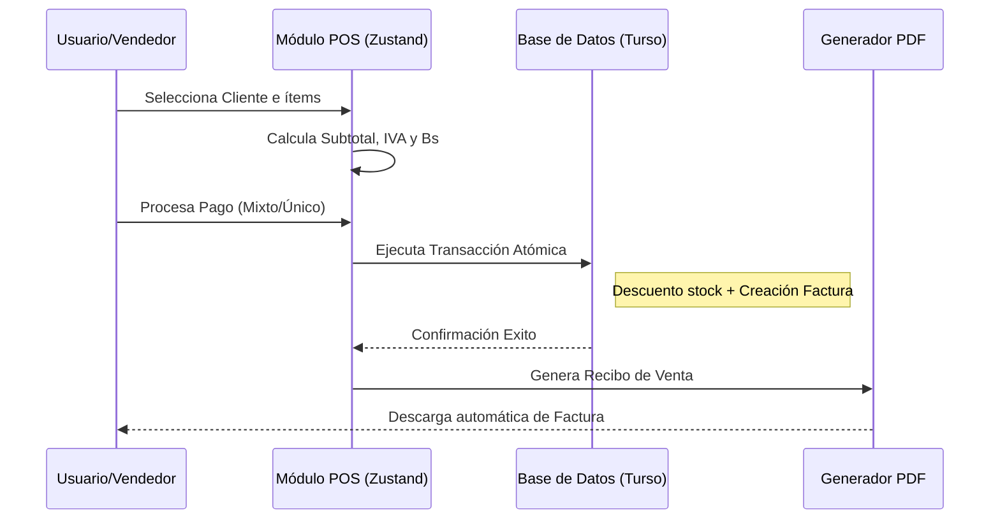

# Sistema POS Empresarial - Negocios

Bienvenido al **Sistema POS Empresarial**, una solución moderna y robusta construida con **Next.js 15**, **Turso (LibSQL)** y **Tailwind CSS**. Este sistema está diseñado para la gestión eficiente de ventas, inventario, personal y facturación en entornos multimoneda.

---

## 📊 Arquitectura y Flujo

El sistema opera bajo una arquitectura de componentes cliente-servidor con persistencia en el edge.

### Diagrama de Flujo de Venta



---

## 🛠️ Requisitos Previos

Antes de comenzar, asegúrate de tener instalado:

- **Node.js** (v20 o superior)
- **Git**
- Una cuenta en **Turso** (para la base de datos distribuida)

---

## 🚀 Guía de Instalación Paso a Paso

### 1. Clonar el Proyecto

```bash
git clone https://github.com/zoro7u7/negocios.git
cd negocios
```

### 2. Instalar Dependencias

```bash
npm install
```

### 3. Configurar Variables de Entorno

Crea un archivo `.env` en la raíz del proyecto y añade los siguientes valores:

```env
# Conexión a Base de Datos (Turso)
TURSO_DATABASE_URL=libsql://tu-db-url.turso.io
TURSO_AUTH_TOKEN=tu-auth-token-aqui

# Seguridad (Próximo Auth)
AUTH_SECRET=genera-un-secreto-seguro-aqui # Puedes usar: npx auth secret

# Configuración Base
NEXT_PUBLIC_APP_URL=http://localhost:3000
```

### 4. Preparar la Base de Datos

Genera el esquema y ejecuta el seed inicial para crear el primer usuario administrador:

```bash
# Push del esquema a la base de datos
npx drizzle-kit push

# Ejecutar seed (Crea admin/admin123)
npx tsx seed.ts
```

### 5. Iniciar en Desarrollo

```bash
npm run dev
```

---

## ⚙️ Configuraciones Necesarias para Operar

Para que el sistema funcione correctamente, sigue estos pasos al iniciar sesión por primera vez:

1.  **Acceso**: Entra con el usuario `admin` y la contraseña `admin123`.
2.  **Ajuste de Tasas**: Ve a `Configuración`. Define la **Tasa BCV** actual (Bs/$) y el porcentaje de **IVA** global.
3.  **Gestión de Maestros**:
    - Registra a tus **Colaboradores** para asignar comisiones.
    - Carga tus **Productos** (con stock inicial y mínimo) y **Servicios**.
4.  **Clientes**: Puedes agregar clientes frecuentes o usar el "Cliente General" incluido por defecto.

---

## 📂 Estructura del Proyecto

- `/src/actions`: Lógica de servidor (Server Actions) para ventas, reportes y CRUDs.
- `/src/app`: Rutas del sistema (Next.js App Router).
- `/src/components`: Componentes de UI (POS, Formularios, Modales).
- `/src/db`: Esquema de base de datos y configuración de Drizzle.
- `/src/store`: Estado global del carrito (Zustand).
- `/src/lib`: Utilidades (Generación de PDF, Auth).

---

## 🛡️ Seguridad e Integridad

- **Transacciones SQL**: Las ventas son atómicas; si algo falla (ej. falta de stock), nada se guarda en DB para evitar inconsistencias.
- **Snapshots**: La factura guarda una copia del precio y nombre del cliente en el momento de la venta, garantizando que el historial sea inmutable aunque el producto cambie de precio mañana.

---

Desarrollado con ❤️ para la gestión empresarial moderna.
